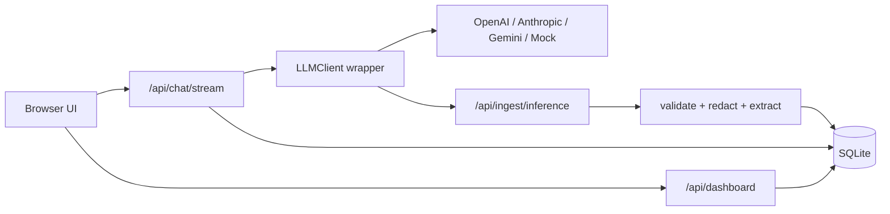

# Lightweight LLM Inference Logging + Ingestion

A small, runnable LLM chat application with a built-in inference logging SDK, ingestion API, SQLite storage, streaming chat, dashboards, and conversation management.

The app works out of the box with a mock provider. Add provider keys to use OpenAI, Anthropic, or Gemini.

## Features

- Multi-turn chatbot with short context window
- Streaming responses over Server-Sent Events
- Cancel in-flight conversations
- List and resume conversations
- Lightweight provider wrapper that records inference metadata
- Near real-time ingestion endpoint
- SQLite schema for conversations, messages, inference logs, and extracted metadata
- Basic latency, throughput, and error dashboards
- PII redaction for emails, phone numbers, SSNs, and credit-card-like numbers
- Docker Compose one-command setup

## Quick Start

```bash
cp .env.example .env
docker compose up --build
```

Open [http://localhost:8080](http://localhost:8080).

Without API keys, the app uses `mock`, which streams a local response and still exercises the logging and ingestion pipeline.

## Deploy On Vercel

This repository includes `api/index.py` and `vercel.json` for Vercel Python Functions.

1. Push the repo to GitHub.
2. Import the repo in Vercel.
3. Add these environment variables in Vercel Project Settings:

```bash
LLM_PROVIDER=gemini
LLM_MODEL=gemini-2.5-flash
GEMINI_API_KEY=your_key_here
```

4. Deploy.

Vercel demo note: by default the app uses SQLite at `/tmp/app.db` on Vercel. That is fine for a live demo, but it is ephemeral serverless storage. For durable hosted logs, replace SQLite with Postgres, Neon, Supabase, or Vercel Postgres.

## Local Python Run

```bash
python -m app.server
```

Optional environment variables:

```bash
LLM_PROVIDER=mock
LLM_MODEL=mock-small
OPENAI_API_KEY=
ANTHROPIC_API_KEY=
GEMINI_API_KEY=
DATABASE_PATH=data/app.db
PORT=8080
```

## Architecture Overview



The chat route stores user messages first, loads a short context window, streams model output, stores the assistant message, and emits an inference log through the SDK wrapper. The wrapper posts to the ingestion endpoint in a background thread so logging does not block the user path.

## Schema Design

`conversations`

- Tracks session identity, title, status, provider/model defaults, and timestamps.
- `status` supports `active` and `cancelled`.

`chat_messages`

- Stores ordered user/assistant/system messages per conversation.
- Uses `sequence` instead of relying on timestamps for deterministic replay.

`inference_logs`

- Stores the canonical raw inference event received by ingestion.
- Includes provider, model, latency, token counts, status, error, previews, and trace IDs.

`inference_metadata`

- Stores extracted query-friendly dimensions such as redaction counts, stream flag, context message count, and preview lengths.
- Kept separate so the ingestion contract can evolve without migrating every analytics field into the hot log table.

## Tradeoffs

- SQLite is intentionally simple and great for a demo or small internal tool. For production, use Postgres plus a queue.
- Provider adapters use direct HTTP calls to avoid heavyweight SDK dependencies. Official SDKs would reduce edge-case handling in a larger app.
- Token usage is exact when providers return it and estimated otherwise.
- The ingestion call is asynchronous best-effort. Failed log delivery is printed locally; production should persist an outbox.
- PII redaction is regex-based. It catches common patterns but is not a full DLP system.

## Architecture Notes

### Ingestion Flow

1. User sends a chat message.
2. API stores the message and builds recent conversation context.
3. `LLMClient` calls the selected provider and streams output back to the browser.
4. The wrapper records start/end timestamps, latency, status, errors, token usage, and redacted previews.
5. The wrapper posts a structured inference event to `/api/ingest/inference`.
6. Ingestion validates the event, extracts metadata, and writes to SQLite.

### Logging Strategy

Logs are generated at the boundary around the external LLM call. This captures the full request lifecycle without mixing provider-specific details into the UI route. Input and output previews are redacted before persistence to reduce accidental sensitive-data exposure.

### Scaling Considerations

- Replace SQLite with Postgres for concurrent writers and operational analytics.
- Put ingestion behind a queue such as Kafka, NATS, SQS, or Redis Streams.
- Use an outbox table for guaranteed log delivery from the chat service.
- Split chat API, ingestion API, and analytics queries into separate services once traffic requires independent scaling.
- Add indexes by `created_at`, `conversation_id`, `provider`, `model`, and `status`.

### Failure Handling Assumptions

- Chat should continue even if ingestion fails.
- Provider errors are logged with `status=error` and surfaced to the UI.
- Cancellations mark the conversation cancelled and stop streaming locally.
- If exact token usage is unavailable, the wrapper stores a deterministic estimate.

## Demo

Run locally with Docker Compose and open [http://localhost:8080](http://localhost:8080). The dashboard tab shows latency, throughput, and errors after a few messages.

Screenshot: `demo-screenshot.png`

## Repository Layout

```text
app/
  server.py       HTTP API, SSE streaming, static file serving
  db.py           SQLite schema and data access
  llm.py          Lightweight SDK/wrapper and provider adapters
  ingest.py       Validation, PII redaction, metadata extraction
  static/         Frontend assets
Dockerfile
docker-compose.yml
```
